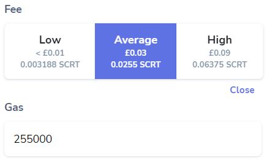
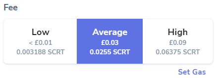

# Transaction Fees

On Secret Network there are two components that make up the transaction fee you pay:

- Gas Fee - the price per unit of Gas
- Gas Amount - the units of gas available for your transaction

This means that there are two ways transactions can fail on the network:

1. The validator processing your transaction has a higher minimum Gas Fee than you are offering
2. The transaction requires more Gas than the Gas Amount you have offered.

The Gas Amount multiplied by the Gas Fee is the Transaction Fee.

## Change Gas Amount

The Gas Amount sets the amount of resources that are available to execute your transaction.

If your transaction fails and the **Gas Used** is higher than the **Gas Wanted** you should manually increase the Gas Amount.

1. Click **Set Gas** below the Fee buttons
2. Enter the new Gas amount into the Amount field ~50,000 above the **Gas Used** value.

!!! warning
    Increasing the Gas Amount will increase the cost of the overall cost of the transaction so it is important not to set it to an excessive amount. Always check the total you will pay for the transaction before clicking Approve. 

## Change Gas Fee

In the vast majority of cases the **Average** Fee shown in Keplr will be accepted by validators. 

Setting the Gas Fee to **Low** should work in most cases, but some validators will reject it.

